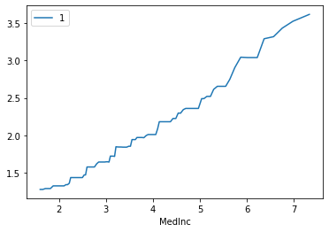
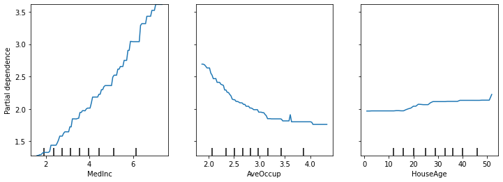
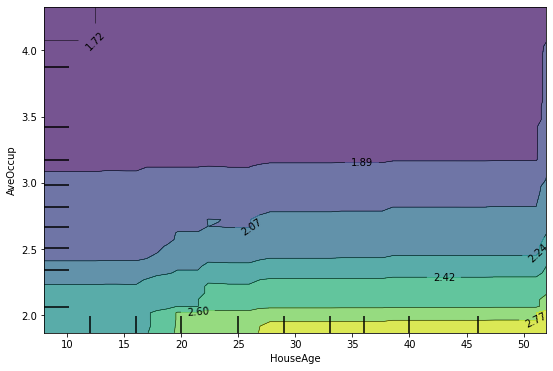
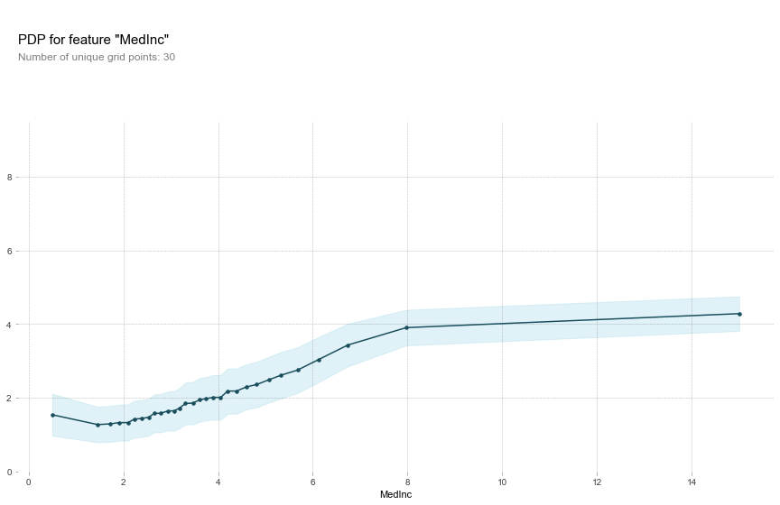
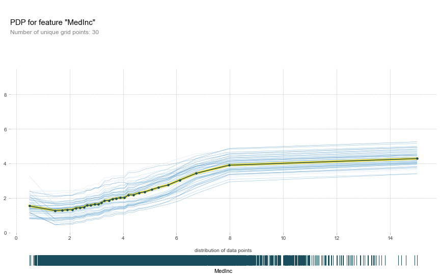
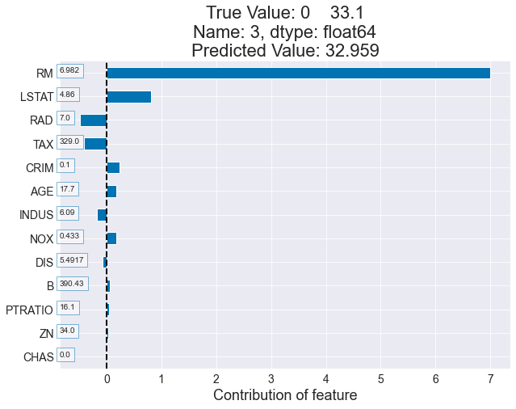
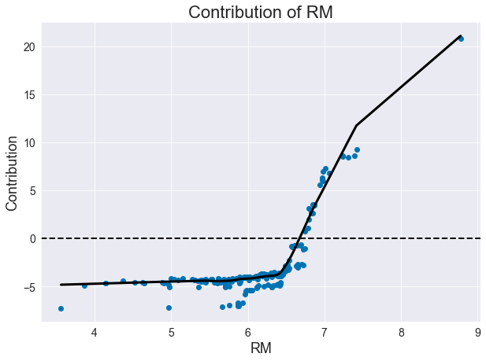

# 第14章  模型解释

相关数据和代码


## 导入相关包

```python
import pandas as pd

import matplotlib.pyplot as plt
from sklearn.model_selection import train_test_split
from sklearn.inspection import plot_partial_dependence
from sklearn.datasets import fetch_california_housing
from sklearn.tree import DecisionTreeRegressor

from sklearn.ensemble import GradientBoostingRegressor
```
## 数据准备
>> 线上下载方式（书中已经提供数据附件）：
cal_housing = fetch_california_housing()
X = pd.DataFrame(cal_housing.data, columns=cal_housing.feature_names)
y = cal_housing.target
#y -= y.mean()


```python
df = pd.read_csv('california_housing.csv')
df.shape
```
    (20640, 9)


```python
df.head()
```


|      | MedInc | HouseAge | AveRooms | AveBedrms | Population | AveOccup | Latitude | Longitude | target |
| ---- | ------ | -------- | -------- | --------- | ---------- | -------- | -------- | --------- | ------ |
| 0    | 8.3252 | 41       | 6.9841   | 1.0238    | 322        | 2.5556   | 37.88    | -122.2    | 4.526  |
| 1    | 8.3014 | 21       | 6.2381   | 0.9719    | 2401       | 2.1098   | 37.86    | -122.2    | 3.585  |
| 2    | 7.2574 | 52       | 8.2881   | 1.0734    | 496        | 2.8023   | 37.85    | -122.2    | 3.521  |
| 3    | 5.6431 | 52       | 5.8174   | 1.0731    | 558        | 2.5479   | 37.85    | -122.3    | 3.413  |
| 4    | 3.8462 | 52       | 6.2819   | 1.0811    | 565        | 2.1815   | 37.85    | -122.3    | 3.422  |


```python
feature_names = [
    'MedInc', 'HouseAge', 'AveRooms', 'AveBedrms', 'Population', 'AveOccup',
    'Latitude', 'Longitude'
]
```


```python
X_train, X_test, y_train, y_test = train_test_split(df[feature_names],
                                                    df['target'],
                                                    test_size=0.3,
                                                    random_state=42)
```


```python
gbdt = GradientBoostingRegressor()
gbdt.fit(X_train, y_train)
```


    GradientBoostingRegressor(alpha=0.9, ccp_alpha=0.0, criterion='friedman_mse',
                              init=None, learning_rate=0.1, loss='ls', max_depth=3,
                              max_features=None, max_leaf_nodes=None,
                              min_impurity_decrease=0.0, min_impurity_split=None,
                              min_samples_leaf=1, min_samples_split=2,
                              min_weight_fraction_leaf=0.0, n_estimators=100,
                              n_iter_no_change=None, presort='deprecated',
                              random_state=None, subsample=1.0, tol=0.0001,
                              validation_fraction=0.1, verbose=0, warm_start=False)


## plot_single_column_pdp


```python
%run single_column_pdp.py
```


```python
plot_single_column_pdp(gbdt,X_train,'MedInc')
```





### plot_partial_dependence


```python
fig, ax = plt.subplots(figsize=(12, 4))
plot_partial_dependence(gbdt,
                        X_train, ['MedInc', 'AveOccup', 'HouseAge'],
                        method='brute',
                        ax=ax)
```


    <sklearn.inspection._partial_dependence.PartialDependenceDisplay at 0x12c4da438>





```python
fig, ax = plt.subplots(figsize=(9, 6))
plot_partial_dependence(gbdt,
                        X_train, [('HouseAge', 'AveOccup')],
                        grid_resolution=50,
                        method='brute',
                        ax=ax)
```


    <sklearn.inspection._partial_dependence.PartialDependenceDisplay at 0x12c745c18>





## pdpbox


```python
from pdpbox import pdp
```


```python
pdp_MedInc = pdp.pdp_isolate(model=gbdt,
                             dataset=X_train,
                             model_features=X_train.columns.tolist(),
                             feature='MedInc',
                             num_grid_points=30)
_ = pdp.pdp_plot(
    pdp_MedInc,
    'MedInc',
    center=False,
)
```





### ICE


```python
_ = pdp.pdp_plot(pdp_MedInc,
                 'MedInc',
                 center=False,
                 plot_lines=True,
                 frac_to_plot=50,
                 plot_pts_dist=True)
```





### info_plots


```python
from pdpbox import info_plots

fig, axes, summary_df = info_plots.target_plot(df=df,
                                               feature='MedInc',
                                               feature_name='MedInc',
                                               target='target',
                                               show_percentile=True)
```


## Treeinterpreter


```python
import numpy as np
from sklearn.datasets import load_boston
from treeinterpreter import treeinterpreter as ti
from sklearn.ensemble import RandomForestRegressor
```


```python
boston = load_boston()
rf = RandomForestRegressor(random_state=42)
rf.fit(boston.data[:300], boston.target[:300])
```


    RandomForestRegressor(bootstrap=True, ccp_alpha=0.0, criterion='mse',
                          max_depth=None, max_features='auto', max_leaf_nodes=None,
                          max_samples=None, min_impurity_decrease=0.0,
                          min_impurity_split=None, min_samples_leaf=1,
                          min_samples_split=2, min_weight_fraction_leaf=0.0,
                          n_estimators=100, n_jobs=None, oob_score=False,
                          random_state=42, verbose=0, warm_start=False)


```python
instances = boston.data[[300, 309]]
rf.predict(instances)

    array([29.729, 23.315])
```


```python
prediction, bias, contributions = ti.predict(rf, instances)
for i in range(len(instances)):
    print("Instance {} : {:.2f}".format(i,prediction[i][0]))
    print("Bias (trainset mean) {:.2f}".format(bias[i]))
    print("Feature contributions:")
    for c, feature in sorted(zip(contributions[i], boston.feature_names),
                             key=lambda x: -abs(x[0])):
        print('{}{} {:.2f}'.format(' '*4 ,feature, c))
    print("-" * 30)
```

    Instance 0 : 29.73
    Bias (trainset mean) 25.56
    Feature contributions:
        RM 3.43
        LSTAT 1.13
        DIS -0.51
        PTRATIO 0.43
        TAX -0.35
        B -0.19
        RAD 0.15
        CRIM -0.13
        AGE 0.11
        INDUS 0.09
        ZN 0.06
        NOX -0.05
        CHAS 0.02
    ------------------------------
    Instance 1 : 23.32
    Bias (trainset mean) 25.56
    Feature contributions:
        RM -5.49
        LSTAT 2.56
        CRIM 0.54
        TAX -0.19
        PTRATIO 0.17
        DIS 0.11
        RAD 0.06
        INDUS 0.06
        B -0.04
        NOX 0.04
        CHAS -0.03
        AGE -0.02
        ZN 0.00
    ------------------------------


```python
# Set default matplotlib settings
plt.rcParams['figure.figsize'] = (10, 7)
plt.rcParams['lines.linewidth'] = 3
plt.rcParams['figure.titlesize'] = 26
plt.rcParams['axes.labelsize'] = 18
plt.rcParams['axes.titlesize'] = 22
plt.rcParams['xtick.labelsize'] = 14
plt.rcParams['ytick.labelsize'] = 14
plt.rcParams['legend.fontsize'] = 16

# Set seaborn colours
sns.set_style('darkgrid')
sns.set_palette('colorblind')
blue, green, red, purple, yellow, cyan = sns.color_palette('colorblind',6)
```


```python
from tree_interp_functions import *

t_df = pd.DataFrame(boston.data[300:],columns=boston.feature_names)
```


```python
prediction_t, bias_t, contributions_t = ti.predict(rf, boston.data[300:])
```


```python
df, true_label, score = plot_obs_feature_contrib(rf,
                                                 contributions_t,
                                                 t_df,
                                                 pd.DataFrame(boston.target[300:]),
                                                 3,
                                                 order_by='contribution',
                                                 
                                                )
```





```python
plot_single_feat_contrib('RM',
                         contributions_t,
                         t_df,
                         class_index=1,
                         add_smooth=True,
                         frac=0.3)
```





```python
prediction, bias, contributions = ti.predict(rf,
                                             instances[0].reshape(1, -1),
                                             joint_contribution=True)
```


```python
ret = []
for k in contributions[0].keys():
    v = np.round(contributions[0].get(k, 0)[0], 3)
    ret.append(([boston["feature_names"][i] for i in k], v))
ret
```


    [(['RM'], 2.864),
     (['INDUS', 'RM', 'AGE', 'DIS', 'RAD'], 0.002),
     (['INDUS', 'RM', 'DIS', 'RAD'], 0.006),
     (['RM', 'DIS'], -0.03),
     (['INDUS', 'RM', 'DIS'], -0.038),
     (['CRIM', 'INDUS', 'RM', 'AGE', 'DIS', 'TAX', 'B'], 0.004),
     (['CRIM', 'INDUS', 'RM', 'TAX'], -0.004),
     (['CRIM', 'INDUS', 'RM', 'TAX', 'B'], -0.007),
     (['CRIM', 'INDUS', 'RM', 'AGE', 'TAX', 'B'], 0.001),
     (['CRIM', 'INDUS', 'RM'], 0.004),
     (['INDUS', 'RM'], 0.053),
     (['RM', 'DIS', 'TAX'], -0.07),
     (['RM', 'AGE', 'DIS', 'RAD', 'TAX'], -0.002),
     (['RM', 'AGE', 'DIS', 'TAX'], -0.004),
     (['CRIM', 'INDUS', 'RM', 'DIS', 'TAX'], -0.01),
     (['CRIM', 'INDUS', 'RM', 'AGE', 'DIS', 'TAX'], 0.027),
     (['INDUS', 'RM', 'TAX'], -0.009),
     (['INDUS', 'RM', 'DIS', 'TAX'], -0.003),
     (['RM', 'DIS', 'B', 'LSTAT'], -0.034),
     (['RM', 'DIS', 'PTRATIO', 'B', 'LSTAT'], 0.003),
     (['RM', 'LSTAT'], 1.809),
     (['RM', 'DIS', 'LSTAT'], -0.308),
     (['INDUS', 'RM', 'DIS', 'PTRATIO', 'B', 'LSTAT'], -0.011),
     (['RM', 'TAX'], -0.085),
     (['CRIM', 'ZN', 'NOX', 'RM', 'TAX', 'PTRATIO'], 0.002),
     (['CRIM', 'ZN', 'RM', 'TAX'], -0.014),
     (['CRIM', 'ZN', 'RM', 'TAX', 'PTRATIO'], -0.004),
     (['ZN', 'RM', 'TAX'], 0.024),
     (['ZN', 'RM', 'AGE', 'DIS', 'RAD', 'LSTAT'], 0.002),
     (['RM', 'AGE', 'RAD', 'LSTAT'], 0.004),
     (['CRIM', 'ZN', 'RM', 'AGE', 'DIS', 'RAD', 'LSTAT'], -0.003),
     (['RM', 'AGE', 'DIS', 'RAD', 'LSTAT'], 0.015),
     (['RM', 'RAD', 'LSTAT'], 0.052),
     (['RM', 'TAX', 'PTRATIO', 'LSTAT'], -0.035),
     (['RM', 'PTRATIO', 'LSTAT'], 0.367),
     (['CRIM', 'INDUS', 'NOX', 'RM', 'AGE', 'DIS', 'PTRATIO', 'LSTAT'], -0.007),
     (['RM', 'AGE', 'DIS', 'LSTAT'], 0.019),
     (['INDUS', 'NOX', 'RM', 'AGE', 'DIS', 'LSTAT'], -0.002),
     (['NOX', 'RM', 'AGE', 'DIS', 'LSTAT'], -0.01),
     (['INDUS', 'NOX', 'RM', 'AGE', 'DIS', 'PTRATIO', 'LSTAT'], -0.014),
     (['CRIM', 'NOX', 'RM'], -0.032),
     (['NOX', 'RM'], 0.022),
     (['CRIM', 'NOX', 'RM', 'LSTAT'], -0.001),
     (['RM', 'B'], -0.065),
     (['NOX', 'RM', 'B'], -0.023),
     (['RM', 'DIS', 'TAX', 'LSTAT'], -0.076),
     (['CRIM', 'RM', 'DIS', 'LSTAT'], -0.023),
     (['RM', 'TAX', 'PTRATIO'], 0.008),
     (['ZN', 'RM', 'TAX', 'PTRATIO', 'LSTAT'], -0.01),
     (['ZN', 'RM', 'DIS', 'B', 'LSTAT'], -0.003),
     (['CRIM', 'RM', 'LSTAT'], -0.059),
     (['CRIM', 'RM', 'AGE', 'DIS', 'PTRATIO', 'LSTAT'], 0.006),
     (['CRIM', 'RM', 'AGE', 'DIS', 'LSTAT'], -0.007),
     (['RM', 'TAX', 'LSTAT'], -0.015),
     (['NOX', 'RM', 'TAX', 'LSTAT'], -0.009),
     (['CRIM', 'RM', 'TAX', 'LSTAT'], -0.008),
     (['CRIM', 'RM', 'DIS', 'TAX', 'LSTAT'], -0.044),
     (['RM', 'DIS', 'PTRATIO', 'LSTAT'], -0.044),
     (['ZN', 'INDUS', 'RM', 'TAX'], -0.007),
     (['ZN', 'INDUS', 'RM', 'AGE', 'DIS', 'TAX'], -0.002),
     (['ZN', 'INDUS', 'RM', 'DIS', 'TAX'], 0.006),
     (['ZN', 'INDUS', 'RM', 'AGE', 'DIS', 'TAX', 'PTRATIO'], -0.004),
     (['CRIM', 'NOX', 'RM', 'DIS'], -0.013),
     (['NOX', 'RM', 'DIS'], -0.016),
     (['CRIM', 'NOX', 'RM', 'DIS', 'PTRATIO'], -0.008),
     (['INDUS', 'RM', 'TAX', 'LSTAT'], -0.051),
     (['CHAS', 'RM', 'AGE', 'PTRATIO', 'B', 'LSTAT'], -0.004),
     (['CHAS', 'RM', 'PTRATIO', 'B', 'LSTAT'], -0.002),
     (['CHAS', 'RM', 'LSTAT'], 0.016),
     (['CHAS', 'RM', 'B', 'LSTAT'], -0.005),
     (['CRIM', 'NOX', 'RM', 'AGE', 'PTRATIO'], -0.003),
     (['RM', 'AGE'], 0.041),
     (['CRIM', 'INDUS', 'NOX', 'RM', 'AGE', 'PTRATIO', 'LSTAT'], 0.003),
     (['CRIM', 'NOX', 'RM', 'AGE'], -0.008),
     (['CRIM', 'INDUS', 'NOX', 'RM', 'AGE', 'PTRATIO'], -0.003),
     (['NOX', 'RM', 'AGE'], -0.009),
     (['RM', 'AGE', 'PTRATIO', 'LSTAT'], -0.004),
     (['CRIM', 'RM', 'TAX', 'PTRATIO', 'LSTAT'], 0.0),
     (['CRIM', 'RM', 'AGE', 'TAX', 'PTRATIO', 'LSTAT'], 0.0),
     (['CRIM', 'ZN', 'RM', 'LSTAT'], -0.01),
     (['CRIM', 'INDUS', 'RM', 'DIS', 'LSTAT'], -0.024),
     (['CRIM', 'INDUS', 'RM', 'LSTAT'], -0.019),
     (['NOX', 'RM', 'LSTAT'], -0.028),
     (['ZN', 'NOX', 'RM', 'TAX', 'LSTAT'], 0.013),
     (['ZN', 'RM', 'TAX', 'LSTAT'], 0.027),
     (['ZN', 'RM', 'RAD', 'B', 'LSTAT'], 0.004),
     (['RM', 'RAD', 'B', 'LSTAT'], -0.002),
     (['NOX', 'RM', 'DIS', 'LSTAT'], 0.053),
     (['ZN', 'RM', 'LSTAT'], 0.02),
     (['ZN', 'RM', 'DIS', 'LSTAT'], 0.008),
     (['INDUS', 'RM', 'DIS', 'B', 'LSTAT'], -0.001),
     (['INDUS', 'RM', 'DIS', 'LSTAT'], 0.008),
     (['RM', 'AGE', 'DIS', 'PTRATIO', 'LSTAT'], -0.001),
     (['NOX', 'RM', 'RAD', 'LSTAT'], -0.014),
     (['RM', 'AGE', 'DIS', 'RAD', 'PTRATIO', 'LSTAT'], -0.004),
     (['CRIM', 'RM', 'AGE', 'DIS', 'RAD', 'PTRATIO', 'LSTAT'], -0.0),
     (['RM', 'AGE', 'LSTAT'], 0.005),
     (['INDUS', 'NOX', 'RM', 'LSTAT'], 0.002),
     (['INDUS', 'NOX', 'RM', 'AGE', 'LSTAT'], 0.008),
     (['INDUS', 'NOX', 'RM'], 0.01),
     (['RM', 'DIS', 'TAX', 'PTRATIO', 'LSTAT'], -0.007),
     (['RM', 'DIS', 'RAD', 'PTRATIO', 'B', 'LSTAT'], 0.01),
     (['RM', 'PTRATIO', 'B', 'LSTAT'], -0.045),
     (['RM', 'DIS', 'RAD', 'TAX', 'PTRATIO', 'B', 'LSTAT'], 0.003),
     (['NOX', 'RM', 'AGE', 'RAD', 'B'], 0.027),
     (['NOX', 'RM', 'AGE', 'RAD'], 0.018),
     (['NOX', 'RM', 'RAD'], -0.012),
     (['INDUS', 'RM', 'LSTAT'], 0.109),
     (['CRIM', 'RM', 'PTRATIO', 'B', 'LSTAT'], -0.001),
     (['ZN', 'RM', 'AGE', 'B'], -0.006),
     (['RM', 'AGE', 'B'], -0.033),
     (['CRIM', 'NOX', 'RM', 'AGE', 'DIS'], 0.003),
     (['RM', 'AGE', 'DIS'], 0.006),
     (['NOX', 'RM', 'AGE', 'DIS'], -0.008),
     (['CRIM', 'INDUS', 'NOX', 'RM', 'AGE', 'DIS'], 0.002),
     (['RM', 'DIS', 'RAD', 'TAX', 'LSTAT'], 0.011),
     (['CRIM', 'RM', 'B', 'LSTAT'], -0.006),
     (['RM', 'B', 'LSTAT'], 0.009),
     (['INDUS', 'RM', 'PTRATIO', 'LSTAT'], 0.011),
     (['RM', 'RAD', 'TAX', 'LSTAT'], -0.013),
     (['RM', 'RAD', 'TAX', 'B', 'LSTAT'], -0.001),
     (['NOX', 'RM', 'PTRATIO', 'LSTAT'], 0.004),
     (['CRIM', 'NOX', 'RM', 'TAX', 'PTRATIO', 'B', 'LSTAT'], -0.002),
     (['NOX', 'RM', 'TAX', 'PTRATIO', 'B', 'LSTAT'], 0.024),
     (['NOX', 'RM', 'TAX', 'PTRATIO', 'LSTAT'], -0.002),
     (['RM', 'AGE', 'DIS', 'TAX', 'B', 'LSTAT'], -0.014),
     (['RM', 'AGE', 'DIS', 'TAX', 'LSTAT'], -0.004),
     (['ZN', 'RM', 'AGE', 'DIS', 'LSTAT'], -0.008),
     (['RM', 'DIS', 'RAD', 'LSTAT'], 0.01),
     (['CRIM', 'RM', 'AGE', 'TAX'], -0.009),
     (['CRIM', 'RM', 'AGE', 'TAX', 'PTRATIO', 'B'], -0.02),
     (['CRIM', 'RM'], -0.055),
     (['CRIM', 'RM', 'AGE'], 0.004),
     (['CRIM', 'RM', 'AGE', 'TAX', 'PTRATIO'], 0.004),
     (['INDUS', 'RM', 'DIS', 'PTRATIO', 'LSTAT'], 0.024),
     (['ZN', 'RM', 'AGE', 'DIS', 'PTRATIO', 'LSTAT'], 0.002),
     (['ZN', 'RM', 'AGE', 'DIS', 'TAX', 'PTRATIO', 'LSTAT'], -0.004),
     (['RM', 'TAX', 'B', 'LSTAT'], -0.011),
     (['RM', 'TAX', 'PTRATIO', 'B', 'LSTAT'], -0.002),
     (['ZN', 'RM', 'TAX', 'PTRATIO', 'B', 'LSTAT'], 0.001),
     (['INDUS', 'RM', 'B', 'LSTAT'], -0.019),
     (['CRIM', 'CHAS', 'RM', 'TAX'], -0.0),
     (['CRIM', 'RM', 'TAX'], -0.016),
     (['NOX', 'RM', 'AGE', 'DIS', 'TAX', 'PTRATIO'], -0.013),
     (['RM', 'AGE', 'DIS', 'TAX', 'PTRATIO'], -0.003),
     (['RM', 'AGE', 'PTRATIO'], 0.05),
     (['RM', 'AGE', 'TAX', 'PTRATIO', 'B'], -0.003),
     (['RM', 'AGE', 'TAX', 'B'], -0.014),
     (['RM', 'RAD'], 0.004),
     (['ZN', 'RM', 'AGE', 'RAD'], 0.011),
     (['RM', 'AGE', 'RAD'], -0.021),
     (['ZN', 'RM', 'AGE', 'RAD', 'B'], -0.011),
     (['ZN', 'RM', 'AGE', 'RAD', 'TAX', 'B'], -0.002),
     (['ZN', 'RM', 'AGE', 'DIS', 'RAD', 'TAX', 'B'], 0.002),
     (['RM', 'AGE', 'RAD', 'TAX', 'B'], 0.004),
     (['RM', 'RAD', 'TAX'], -0.003),
     (['RM', 'RAD', 'TAX', 'B'], -0.006),
     (['RM', 'AGE', 'RAD', 'TAX', 'B', 'LSTAT'], -0.002),
     (['CRIM', 'RM', 'AGE', 'RAD', 'TAX', 'B', 'LSTAT'], 0.002),
     (['RM', 'RAD', 'PTRATIO', 'B', 'LSTAT'], -0.006),
     (['RM', 'AGE', 'PTRATIO', 'B', 'LSTAT'], 0.012),
     (['CRIM', 'RM', 'DIS', 'B', 'LSTAT'], 0.018),
     (['INDUS', 'RM', 'RAD', 'B', 'LSTAT'], 0.007),
     (['ZN', 'INDUS', 'RM', 'RAD', 'B', 'LSTAT'], 0.002),
     (['CRIM', 'RM', 'RAD'], 0.007),
     (['ZN', 'NOX', 'RM', 'AGE', 'TAX'], -0.01),
     (['ZN', 'RM', 'AGE', 'TAX'], 0.007),
     (['ZN', 'NOX', 'RM', 'DIS', 'LSTAT'], 0.002),
     (['INDUS', 'NOX', 'RM', 'AGE', 'B'], 0.003),
     (['INDUS', 'NOX', 'RM', 'B'], -0.0),
     (['CRIM', 'RM', 'DIS'], 0.012),
     (['CRIM', 'RM', 'AGE', 'DIS'], -0.001),
     (['CRIM', 'RM', 'AGE', 'DIS', 'RAD'], -0.001),
     (['NOX', 'RM', 'DIS', 'TAX'], 0.002),
     (['INDUS', 'RM', 'RAD', 'PTRATIO'], -0.006),
     (['RM', 'RAD', 'PTRATIO'], -0.025),
     (['CRIM', 'RM', 'TAX', 'PTRATIO', 'B', 'LSTAT'], -0.007),
     (['CRIM', 'RM', 'PTRATIO', 'LSTAT'], 0.004),
     (['CRIM', 'INDUS', 'RM', 'TAX', 'PTRATIO', 'B', 'LSTAT'], 0.003),
     (['NOX', 'RM', 'AGE', 'DIS', 'RAD', 'PTRATIO', 'LSTAT'], 0.02),
     (['NOX', 'RM', 'AGE', 'DIS', 'PTRATIO', 'LSTAT'], 0.005),
     (['NOX', 'RM', 'AGE', 'DIS', 'RAD', 'PTRATIO', 'B', 'LSTAT'], -0.011)]
