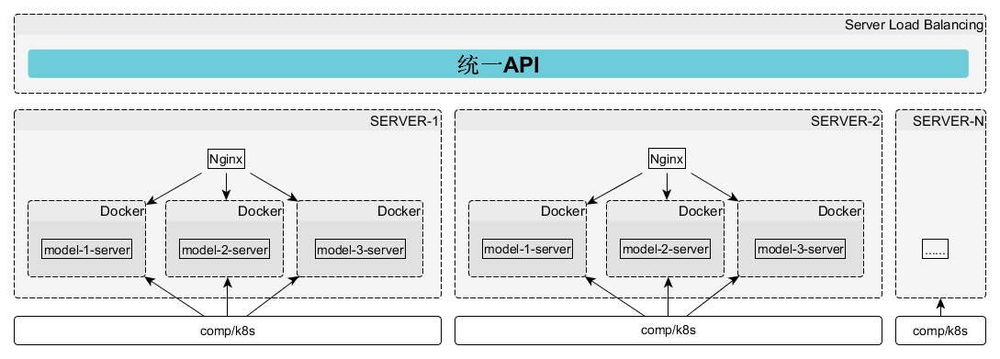

# 第15章  模型上线之模型即服务

相关数据和代码

## docker封装部署请参考arc文件夹和书中说明

企业级模型服务部署架构如下：





## 规则转化为 Python/ C/Java /SQL 代码示例

decision tree rules to python,c,java,sql etc.


```python
test_ruls = DtRules2Code(clf,col_names)

test_ruls.generate_c_code()
```

输出

```c
if ( v3 <= 0.039 ) {
    if ( v3 <= -0.489 ) {
        if ( v3 <= -1.084 ) {
            //samples:222,detail:[[221.   1.]]
            return 0 ;
        } else {
            //samples:177,detail:[[165.  12.]]
            return 0 ;
        }
    } else {
        if ( v1 <= -0.186 ) {
            //samples:45,detail:[[25. 20.]]
            return 0 ;
        } else {
            //samples:89,detail:[[67. 22.]]
            return 0 ;
        }
    }
} else {
    if ( v3 <= 0.377 ) {
        if ( v3 <= 0.354 ) {
            //samples:64,detail:[[16. 48.]]
            return 1 ;
        } else {
            //samples:2,detail:[[2. 0.]]
            return 0 ;
        }
    } else {
        if ( v2 <= -0.835 ) {
            //samples:87,detail:[[ 4. 83.]]
            return 1 ;
        } else {
            //samples:314,detail:[[  3. 311.]]
            return 1 ;
        }
    }
}
```


```python
test_ruls.generate_python_code()
```
```python
if v3 <= 0.039:
    if v3 <= -0.489:
        if v3 <= -1.084:
            # samples:222,detail:[[221.   1.]]
            return 0
        else:
            # samples:177,detail:[[165.  12.]]
            return 0
        
    else:
        if v1 <= -0.186:
            # samples:45,detail:[[25. 20.]]
            return 0
        else:
            # samples:89,detail:[[67. 22.]]
            return 0
        
    
else:
    if v3 <= 0.377:
        if v3 <= 0.354:
            # samples:64,detail:[[16. 48.]]
            return 1
        else:
            # samples:2,detail:[[2. 0.]]
            return 0
        
    else:
        if v2 <= -0.835:
            # samples:87,detail:[[ 4. 83.]]
            return 1
        else:
            # samples:314,detail:[[  3. 311.]]
            return 1
```


```python
test_ruls.generate_sql_code()
```

```sql
CASE 
  WHEN v3<=0.039 AND v3<=-0.489 AND v3<=-1.084  THEN 0
  WHEN v3<=0.039 AND v3<=-0.489 AND v3>-1.084  THEN 0
  WHEN v3<=0.039 AND v3>-0.489 AND v1<=-0.186  THEN 0
  WHEN v3<=0.039 AND v3>-0.489 AND v1>-0.186  THEN 0
  WHEN v3>0.039 AND v3<=0.377 AND v3<=0.354  THEN 1
  WHEN v3>0.039 AND v3<=0.377 AND v3>0.354  THEN 0
  WHEN v3>0.039 AND v3>0.377 AND v2<=-0.835  THEN 1
  WHEN v3>0.039 AND v3>0.377 AND v2>-0.835  THEN 1
ELSE -1 END
```

