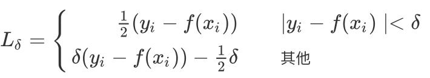
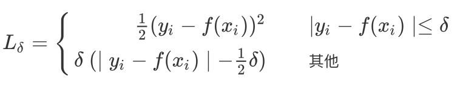
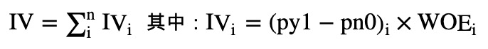
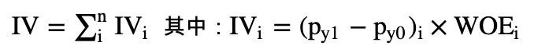

# 第1章 第27页代码缩进错误
> github中的 ipynb文件是正确的，只是书中缩进错误


错误1：

```python
# 增加先验
def __init__(self, spam_dir, ham_dir):
        p_ham = len(self.ham_list) / (len(self.ham_list) + len(self.spam_list))
        self.P = {self.CAT[0]: p_ham, self.CAT[1]: 1 - p_ham}
 def score(self, email_file):
        if self.total_count[self.CAT[0]] == 0 or self.total_count[
                self.CAT[1]] == 0:
            self.train()
        result = self.P.copy()
        for ww in EmailClassifier.get_words_from_file(email_file):
            for cc in self.CAT:
                v = self.training[cc][ww]
                p = (v + 1) / (self.total_count[cc] + 1)
                result[cc] *= p
```

更正为：

```python
# 增加先验
def __init__(self, spam_dir, ham_dir):
    #...
    p_ham = len(self.ham_list) / (len(self.ham_list) + len(self.spam_list))
    self.P = {self.CAT[0]: p_ham, self.CAT[1]: 1 - p_ham}

#编写功能函数
def score(self, email_file):
    if self.total_count[self.CAT[0]] == 0 or self.total_count[
                self.CAT[1]] == 0:
       self.train()

    result = self.P.copy()
    for ww in EmailClassifier.get_words_from_file(email_file):
         for cc in self.CAT:
             v = self.training[cc][ww]
             p = (v + 1) / (self.total_count[cc] + 1)
             result[cc] *= p
```

错误2:
```python 
@staticmethod  
  def judge(score_dict):
        '''二分类'''
        keys = list(score_dict.keys())
        if score_dict[keys[0]] >= score_dict[keys[1]]:
            return {keys[0]: score_dict[keys[0]]}
        else:
            return {keys[1]: score_dict[keys[1]]}
```

更正为：

```python   
def judge(score_dict):
    '''二分类'''
    keys = self.CAT #list(score_dict.keys())
    if score_dict[keys[0]] >= score_dict[keys[1]]:
        return {keys[0]: score_dict[keys[0]]}
    else:
        return {keys[1]: score_dict[keys[1]]}
```

# 第4章 94页公式(4-6)错误


错误：




更正为：




# 第5章 138页—代码对齐问题


错误：

```python
@staticmethod
    def all_na_cols(df, index=False):
        ''' 全是缺失值的列 ''' 
        if index:
            return DFutils.count_na_col(df) == df.shape[0]
        else:
            return DFutils.ser_index(DFutils.count_na_col(df) == df.shape[0])
      
```

更正为：

```python
    @staticmethod
    def all_na_cols(df, index=False):
        ''' 全是缺失值的列 ''' 
        if index:
            return DFutils.count_na_col(df) == df.shape[0]
        else:
            return DFutils.ser_index(DFutils.count_na_col(df) == df.shape[0])
```

# 第8章 209页 公式8-3

错误：



更正为：



